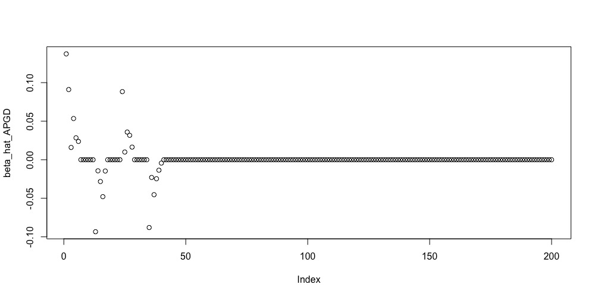
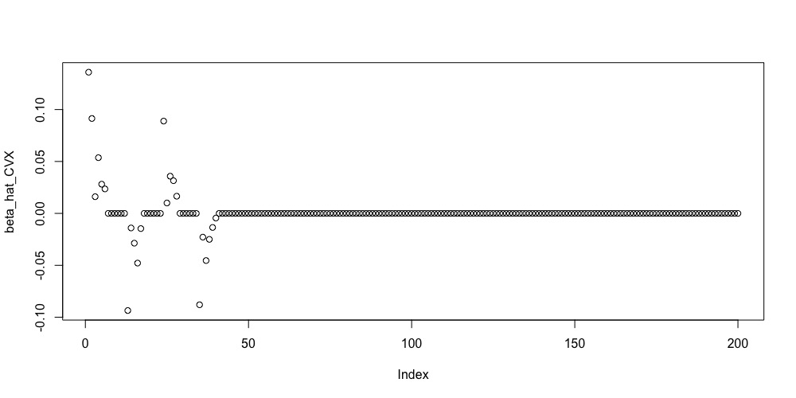

<!-- README.md is generated from README.Rmd. Please edit that file -->

# APGD v.0.1.0

<!-- badges: start -->

The Accelerated Proximal Gradient Descent (APGD) algorithm is a **R** package to solve the penalized regression models, including 

- **HuberNet**: Huber loss function along with Network-based penalty function;
- **HuberLasso**: Huber loss function along with Lasso penalty function;
- **HuberENET**: Huber loss function along with Elastic Net penalty function;
- **ENET**: Mean square error loss function along with Elastic Net penalty function;
- **Lasso**: Mean square error loss function along with Lasso penalty function;
- **Net**: Mean square error loss function along with Network-based penalty function.

We also have [**Python version**](https://github.com/tobefuture/APGD), please see the following link for the guideline of Python version https://github.com/tobefuture/APGD.

## Installation

You can install the released version of APGD from Github with:

``` r
devtools::install_github("xueweic/APGD")
```

## Reference
Xuewei Cao<sup>+</sup>, Ling Zhang<sup>+</sup>, Kui Zhang, Sanzhen Liu, Qiuying Sha*, Hairong Wei*. HuberNet function for interfering target genes of regulatory genes using high-throughput gene expression data.

<sub><sup> <sup>+</sup> These authors have contributed equally to this work </sup></sub>

**Any questions?** xueweic_AT_mtu_DOT_edu, lingzhan_AT_mtu_DOT_edu

## Guideline

### 1. Simulated data

**Step 1**: Construct the network structure from either Hierarchical Network or Barabasi-Albert Network in simulation studies.

- In Hierarchical Network, the number of genes must be the integer times 100.
- In Barabasi-Albert Network, the number of genes must be the integer times 10.

``` r
library(APGD)
N_genes = 200
Adj = ConstructNetwork(N_genes, "HN")
Adj = ConstructNetwork(N_genes, "BAN")
```

**Step 2**: Calculate Laplacian matrix and symmetric normalized Laplacian matrix from an adjacency matrix.

``` r
Sigma1 = GraphicalModel(Adj)
# - Laplacian matrix
res <- CalculateLaplacian(Adj)
L <- res$L
L_norm <- res$L_norm
```

**Step 3**: Simulate y and X from a given network structure (Adjacency matrix and Laplacian matrix).


``` r
N_samples <- 300
res = SimulationData(N_sample, N_genes, Adj, Sigma1, "BAN", beta0 = 1)
y = res$y
X = res$X
```
or 

``` r
res = SimulationData(N_sample, N_genes, Adj, Sigma1, "HN", beta0 = 1)
```

### 2. Estimate Regression Coefficients by APGD or CVX

Calculate the estimated regression coefficients  using one of methods solving by APGD or CVX for a given set of $\alpha_0$ and $\lambda_0$.

- **HuberNet**: Huber loss function along with Network-based penalty function.

``` r
lambda0 = 200
alpha0 = 0.5
beta_hat_APGD <- HuberNet_Beta(X, y, Adj, lambda0, alpha0, method="APGD", if.scale=TRUE)
plot(beta_hat_APGD)
```


``` r
library("CVXR")
beta_hat_CVX <- HuberNet_Beta(X, y, Adj, lambda0, alpha0, method="CVX", if.scale=TRUE)
plot(beta_hat_CVX)
```


- **HuberENET**: Huber loss function along with Elastic Net penalty function.

``` r
lambda0 = 200
alpha0 = 0.5
beta_hat_APGD <- HuberENET_Beta(X, y, lambda0, alpha0, method="APGD", if.scale=TRUE)
library("CVXR")
beta_hat_CVX <- HuberENET_Beta(X, y, lambda0, alpha0, method="CVX", if.scale=TRUE)
```


- **HuberLasso**: Huber loss function along with Lasso penalty function.

``` r
lambda0 = 200
beta_hat_APGD <- HuberLasso_Beta(X, y, lambda0, method="APGD", if.scale=TRUE)
library("CVXR")
beta_hat_CVX <- HuberLasso_Beta(X, y, lambda0, method="CVX", if.scale=TRUE)
```

- **ENET**: Mean square error loss function along with Elastic Net penalty function.

``` r
lambda0 = 200
alpha0 = 0.5
beta_hat_APGD <- ENET_Beta(X, y, lambda0, alpha0, method="APGD", if.scale=TRUE)
library("CVXR")
beta_hat_CVX <- ENET_Beta(X, y, lambda0, alpha0, method="CVX", if.scale=TRUE)
```

- **Lasso**: Mean square error loss function along with Lasso penalty function.

``` r
lambda0 = 200
beta_hat_APGD <- Lasso_Beta(X, y, lambda0, method="APGD", if.scale=TRUE)
library("CVXR")
beta_hat_CVX <- Lasso_Beta(X, y, lambda0, method="CVX", if.scale=TRUE)
```

- **Net**: Mean square error loss function along with Network-based penalty function.

``` r
lambda0 = 200
alpha0 = 0.5
beta_hat_APGD <- Net_Beta(X, y, Adj, lambda0, alpha0, method="APGD", if.scale=TRUE)
library("CVXR")
beta_hat_CVX <- Net_Beta(X, y, Adj,lambda0, alpha0, method="CVX", if.scale=TRUE)
```


### 3. Calculate Selection Probabilities by APGD

To avoid selecting the optimal tuning parameters $\lambda$ and $\alpha$, we can use half-sample resampling method to calculate the selection probabilities of each predictor. The grid of $\lambda$s for a given $\alpha$ from the proposed Huber or MSE loss functions can be calculated by

``` r
alpha <- 0.5
n_lambda <- 10
ratio <- 0.01
lambda_set <- Lambda_grid(X, y, n_lambda, alpha, loss_func = "Huber", ratio)
lambda_set <- Lambda_grid(X, y, n_lambda, alpha, loss_func = "MSE", ratio)
```

The selection probability can be calculated by each method.

``` r
## HuberNet
alphas <- seq(0.1,0.9,0.1)
n_lambda <- 10
B0 <- 100
ratio <- 0.01
SP_HuberNet = HuberNet_SP(X, y, Adj ,alphas, n_lambda, ratio, B=B0, gamma=1000, niter=2000, timer=FALSE)

## HuberENET
SP_HuberENET = HuberENET_SP(X, y, alphas, n_lambda, ratio, B=B0, gamma=1000, niter=2000, timer=FALSE)

## Net
SP_Net = Net_SP(X, y, Adj ,alphas, n_lambda, ratio, B=B0, gamma=1000, niter=2000, timer=FALSE)

## ENET
SP_ENET = ENET_SP(X, y, alphas, n_lambda, ratio, B=B0, gamma=1000, niter=2000, timer=FALSE)

## HuberLasso
n_lambda <- 50
SP_HuberLasso = HuberLasso_SP(X, y, n_lambda, ratio, B=B0, gamma=1000, niter=2000, timer=FALSE)

## Lasso
SP_Lasso = Lasso_SP(X, y, n_lambda, ratio, B=B0, gamma=1000, niter=2000, timer=FALSE)
```

### 4. Real Data Analysis

**Example datasets**

- Sample datasets (TF, PWG, Annotation) for analyzing using HuberNet and Net; 
- Sample datasets (TF, PWG) for analyzing using HuberLasso, Lasso, HuberENET, and ENET.

Example code for HuberNet penalized regression.

``` r
library(APGD)
Sample_data <- APGD::Sample_data
X <- Sample_data$PWG
y <- Sample_data$TF
Annotation <- Sample_data$Annotation

## obtain adjacency matrix from Annotation file
Annotation <- data.matrix(Annotation)
Adj <- CalculateAdj(Annotation)

## Estimate Regression Coefficients by APGD or CVX
lambda0 = 10
alpha0 = 0.5
beta_hat_APGD <- HuberNet_Beta(X, y, Adj, lambda0, alpha0, method="APGD", gamma=1000, niter=2000, crit_beta=1e-4, crit_obj=1e-8)
library("CVXR")
beta_hat_CVX <- HuberNet_Beta(X, y, Adj, lambda0, alpha0, method="CVX")

## Calculate Selection Probabilities by APGD. (90 alpha-lambda pairs and 100 resampling for each pair.)
alphas <- seq(0.1,0.9,0.1)
n_lambda <- 10
B0 <- 100
ratio <- 0.01
SP_HuberNet = HuberNet_SP(X, y, Adj ,alphas, n_lambda, ratio, B=B0, gamma=1000, niter=2000, timer=FALSE)
```


**You Own datasets**


<!-- badges: end -->


